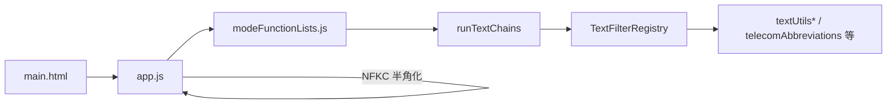

# 変換パイプラインと FilterRegistry

本ドキュメントは、このアプリの **変換処理の全体像** と **`FilterRegistry` クラスの API** を扱います。

- アプリの使い方 → [README.md](../README.md)

---

## 1. アプリ内での位置づけ

変換処理は次の 6 層で構成されています。



| 層 | ファイル | 役割 |
|---|---|---|
| UI | `main.html` | モード選択・入出力・ボタン |
| オーケストレーション | `app.js` | 半角正規化、モードキー取得、パイプライン実行 |
| モード定義 | `modeFunctionLists.js` | モードキー → フィルタチェーン名の対応 |
| チェーン実行 | `textFilterRegistry.js` | `runTextChains`・`TextFilterRegistry` の提供 |
| フィルタ基盤 | `filterRegistry.js` | 名前付きリストの登録・順次実行 |
| 変換関数 | `textUtils*`, `telecomAbbreviations.js` 等 | 実際の文字列変換 |

### 実行フロー

1. ユーザーが **Convert** を押す
2. `app.js` が入力を `toHalfWidth()`（NFKC）で半角正規化する
3. `main.html` のラジオ `value`（例: `officeAction`）をモードキーとして取得する
4. `modeFunctionLists.js` の `ModeFunctionLists[modeKey]` が `runTextChains(names, text)` を呼ぶ
5. `runTextChains` が `TextFilterRegistry.apply(name, text)` を名前の順に実行する
6. 各フィルタリスト内の関数が変換を行い、結果が出力欄に表示される

---

## 2. スクリプト読み込み順

`main.html` では依存関係のため、次の順序で読み込みます。

```
filterRegistry.js          → root.FilterRegistry
textUtilsStd.js            → root.textUtilsStd
textUtilsInit.js           → root.textUtilsInit
textUtilsMain.js           → root.textUtilsMain
stripBlankLines.js         → root.stripBlankLines
textUtilsConvertForDoc.js  → root.textUtilsConvertForDoc
telecomAbbreviations.js    → root.telecomAbbreviations
textUtilsConvertForCau.js  → root.textUtilsConvertForCau
paragraphExtraction.js     → root.paragraphExtraction
makeHtml.js                → root.makeHtml
textFilterRegistry.js      → root.TextFilterRegistry, root.runTextChains
modeFunctionLists.js       → root.ModeFunctionLists
app.js                     → 自動起動
```

---

## 3. モードとパイプライン

`main.html` のラジオ `value`・`modeFunctionLists.js` のキー・`runTextChains` に渡す名前の対応です。

| UI ラベル | モードキー | パイプライン |
|---|---|---|
| Office Action | `officeAction` | `init` → `main` → `stripBlankLines` → `convertEnd` |
| Final Office Action | `finalOfficeAction` | `init` → `main` → `stripBlankLines` → `finalAction` |
| Amendment Refused | `amendmentRefused` | `init` → `main` → `stripBlankLines` → `convertEnd` |
| Pre-examination Report | `preExaminationReport` | `init` → `main` → `stripBlankLines` → `convertEnd` |
| PCT | `pct` | `init` → `main` |
| PCT (English) | `pct_eng` | `init` → `main_PCTENG` |
| Paragraphs | `paragraph` | `parExtract` |
| to HTML | `html` | `tohtml` |

- Final Office Action だけ終端が `convertEnd` ではなく `finalAction`
- PCT 系は `stripBlankLines` / `convertEnd` を通らない
- Paragraphs / to HTML は `init` を通らない

---

## 4. 登録フィルタリスト

`textFilterRegistry.js` が `TextFilterRegistry`（`FilterRegistry` のインスタンス）に登録するリストです。

| 名前 | 処理内容 | 定義元 |
|---|---|---|
| `init` | 改行統一・半角化・制御文字除去・空行削除・行間正規化 | `textUtilsInit` |
| `main` | 略語辞書適用・見出し整形・全角化・クレーム詰めなど | `textUtilsMain`, `textUtilsConvertForCau` |
| `main_PCTENG` | 英語 PCT 向け（`alphaCase` なし） | `textUtilsMain`, `textUtilsConvertForCau` |
| `stripBlankLines` | セクション別の空行削除 | `stripBlankLines` |
| `convertEnd` | 文書末尾の書式変換 | `textUtilsConvertForDoc`, `textUtilsConvertForCau` |
| `finalAction` | 最終拒絶向け末尾処理 | `textUtilsConvertForCau` |
| `parExtract` | 段落・図番号の抽出 | `paragraphExtraction` |
| `tohtml` | HTML 生成 | `makeHtml` |

---

## 5. 拡張ガイド

### モードを追加する

1. `js/modeFunctionLists.js` の `ModeFunctionLists` にモードキーと変換関数を追加する
2. `main.html` のラジオボタンに同じ `value` を設定する
3. 必要なら `textFilterRegistry.js` に新しいフィルタリストを `register` し、`modeFunctionLists.js` の `names` 配列に追加する

`app.js` は起動時に `ModeFunctionLists` を自動登録するため、コア側の変更は通常不要です。

### 変換ルールを編集する

| 変更したい内容 | 触るファイル |
|---|---|
| 前処理（改行・半角化・空行） | `textUtilsInit.js` / `init` 登録 |
| 本文整形 | `textUtilsMain.js` / `main` 登録 |
| セクション別空行削除 | `stripBlankLines.js` |
| 末尾書式変換 | `textUtilsConvertForDoc.js`, `textUtilsConvertForCau.js` |
| 通信・3GPP 略語の追加・変更 | `js/telecomAbbreviations.js`（`replaceMap` / `conditionalShortMap`） |
| モードごとのパイプライン構成 | `modeFunctionLists.js` 内の `names` 配列 |
| フィルタの登録・実行基盤 | 本ドキュメント §6 |

---

## 6. FilterRegistry API

実装: `filterRegistry.js`  
本番利用: `textFilterRegistry.js` が生成する `TextFilterRegistry` インスタンス

### 基本概念

- **フィルタリスト** = 複数のフィルタ関数を順番に実行するパイプライン
- 各フィルタのシグネチャ: `(str: string, ...args: any[]) => string | Promise<string>`
- `apply` は常に `Promise<string>` を返す（同期フィルタも Promise でラップ）

### クイックスタート

```javascript
const reg = new FilterRegistry();

reg.register("simple", [
  (str) => str.toUpperCase(),
  (str) => str + "!",
]);

const out = await reg.apply("simple", "abc");
// "ABC!"
```

### メソッド一覧

| メソッド | 説明 |
|---|---|
| `constructor(options?)` | インスタンス生成。`hooks`, `defaults` を指定可能 |
| `register(name, fnList, options?)` | 名前付きリストの登録・置換 |
| `unregister(name)` | リストの削除 |
| `get(name)` | 登録済みステップの取得（`null` if 未登録） |
| `names()` | 登録済み名の配列 |
| `insert(name, index, filter)` | 既存リストへのステップ挿入 |
| `removeAt(name, index)` | ステップの削除 |
| `enable(name, index, bool)` | ステップの有効/無効切替 |
| `apply(name, str, invokeArgs?)` | 登録済みリストの実行 |
| `applyList(fnList, str, invokeArgs?)` | 登録なしでアドホックリストを実行 |
| `use(plugin)` | プラグイン関数 `(registry) => void` を実行 |

### フィルタ記述子

関数だけでなく、オブジェクト形式でも登録できます。

```javascript
reg.register("prefix", [
  { fn: (str, prefix) => prefix + str, args: ["[OA] "] },
  { fn: (str) => str.trimEnd(), enabled: true },
]);
```

| プロパティ | 型 | 説明 |
|---|---|---|
| `fn` | `FilterFn` | 変換関数（必須） |
| `name` | `string` | デバッグ用の任意名 |
| `args` | `any[]` | ステップ専用の追加引数 |
| `enabled` | `boolean` | `false` でスキップ（デフォルト `true`） |

### フック

コンストラクタの `options.hooks` で指定します。

```javascript
const reg = new FilterRegistry({
  hooks: {
    beforeApply: (name, input) => { /* ... */ },
    afterApply: (name, output) => { /* ... */ },
    onError: (name, error, stage, stepIndex) => { /* ... */ },
  },
  defaults: { stopOnError: true },
});
```

| フック | タイミング |
|---|---|
| `beforeApply` | パイプライン実行前 |
| `afterApply` | パイプライン実行後 |
| `onError` | フックまたはステップでエラー発生時 |

`stopOnError: true`（デフォルト）のとき、ステップエラーでパイプラインを中断します。

### 本アプリ固有のラッパー

`textFilterRegistry.js` が提供するヘルパです。

```javascript
// 複数リストを順に実行
await runTextChains(["init", "main", "convertEnd"], text);

// "init" リストのみ実行
await TextFilterRegistry.apply("init", text);
```

`modeFunctionLists.js` は各モードから `runTextChains(names, text)` を呼び出します。

---

## 7. 型モデル（参考）

```typescript
type FilterFn = (str: string, ...args: any[]) => string | Promise<string>;

interface FilterStep {
  fn: FilterFn;
  name?: string;
  args?: any[];
  enabled?: boolean;
}

interface ListOptions {
  stopOnError?: boolean;
}

interface Hooks {
  beforeApply?: (name: string, input: string) => void | Promise<void>;
  afterApply?: (name: string, output: string) => void | Promise<void>;
  onError?: (name: string, error: unknown, stage: "hook" | "step", stepIndex?: number) => void | Promise<void>;
}
```

---

## 8. エラーハンドリング

- 無効な名前・`fnList`・インデックス → 日本語メッセージの `Error` をスロー
- ステップ実行エラー → `onError` フックを呼び、`stopOnError` に従い中断または続行
- `modeFunctionLists.js` 側は `.catch()` で元テキストを返し、UI が壊れないようにしている
