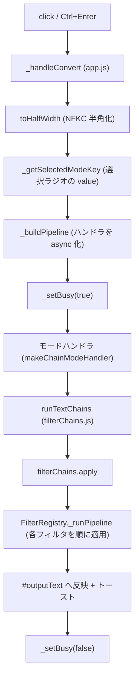

# ボタン別 関数フロー

この文書は、UI（`main.html`）の各ボタン・ショートカット操作ごとに「通過する関数のチェーン」と「各関数が何をするか」を 1〜2 行でまとめたものです。
Convert / Copy の入り口から、モードハンドラ → フィルタチェーン → 個別フィルタ関数までを、実際のコード（`js/*.js` と `filterRegistry/filterRegistry.js`）に沿って追えるようにしています。
コード（特に `js/filterChains.js` のチェーン定義や `js/modeFunctionLists.js` のモード対応）を変更した場合は、この文書も必ず更新してください。

---

## UI 操作の一覧

| 操作 | トリガー | 実行される処理 | 入り口の関数 |
|---|---|---|---|
| Convert ボタン | `#convertBtn` の click | 変換パイプライン実行 | `AppCore._handleConvert`（`js/app.js`） |
| 変換ショートカット | `Ctrl`+`Enter` / `⌘`+`Enter`（入力/出力テキストエリア上） | 変換パイプライン実行（Convert と同じ） | `AppCore._handleConvert`（`js/app.js`） |
| Copy ボタン | `#copyBtn` の click | 出力テキストをクリップボードへコピー | `AppCore._handleCopy`（`js/app.js`） |
| コピーショートカット | `Alt`+`Enter`（入力/出力テキストエリア上） | 出力テキストをコピー（Copy と同じ） | `AppCore._handleCopy`（`js/app.js`） |
| モードラジオ（8 種） | `input[name="mode"]` の選択 | それ自体では何も実行しない。Convert 実行時に `_getSelectedModeKey` が現在の選択値を参照するだけ | （変換時に参照される） |

※ モードラジオの `value`（`officeAction` / `finalOfficeAction` / `amendmentRefused` / `preExaminationReport` / `pct` / `pct_eng` / `paragraph` / `html`）が、そのままモードキーとして使われます。

---

## Convert 押下時の共通フロー

Convert ボタンのクリック（またはショートカット）から出力反映までの「背骨」を、通過順に示します。ファイル名を併記しています。

1. **click / keydown** → イベントバインドは `AppCore._bindEvents`（`js/app.js`）で設定済み。例外は `catch` してトースト表示。
2. **`AppCore._handleConvert`**（`js/app.js`）… 変換処理本体。入力取得 → 半角正規化 → モード判定 → パイプライン実行 → 出力反映までを統括する `async` 関数。
3. **`toHalfWidth(raw)`**（`js/app.js`）… 入力文字列を NFKC で半角正規化する純粋関数（NFKC 非対応環境は全角 ASCII/全角スペースの簡易フォールバック）。
4. **`_getSelectedModeKey()`**（`js/app.js`）… `input[name="mode"]:checked` の `value`（モードキー）を取得。未選択なら中断してトースト表示。
5. **`_buildPipeline(modeKey)`**（`js/app.js`）… `ModeRegistry.getRawHandlers` でモードのハンドラ配列を取得し、各ハンドラを `async (text) => string` に統一ラップした配列を返す。
6. **`_setBusy(true)`**（`js/app.js`）… `.app` に `is-busy` / `aria-busy` を付与し、Convert ボタンを `disabled` にして二重実行を防止（完了後 `finally` で `_setBusy(false)`）。
7. **モードハンドラ**（`js/modeFunctionLists.js` の `makeChainModeHandler` が生成）… 内部で `root.runTextChains(names, text, undefined, { stopOnError: true })` を呼ぶ。`runTextChains` が無ければ入力をそのまま返す。
8. **`runTextChains(names, str, ...)`**（`js/filterChains.js`）… `names` のチェーン名を先頭から順に `filterChains.apply` に流し、前段の出力を次段の入力にする汎用ヘルパ（Promise チェーン）。
9. **`filterChains.apply(name, current)`**（`FilterRegistry` インスタンス）… 名前付きチェーンを 1 つ適用する。内部で `_runPipeline` を呼ぶ。
10. **`FilterRegistry._runPipeline`**（`filterRegistry/filterRegistry.js`）… チェーン内の各フィルタ関数を登録順にシーケンシャル適用（同期/非同期両対応）。前後で `beforeApply` / `afterApply` フック、失敗時は `onError`。
11. **出力反映**（`js/app.js`）… 最終結果を `#outputText`（`this._outputEl.value`）へ代入し、「変換が完了しました。」トーストを表示。

---

## モード別: 実行されるチェーンと関数

各モードが `runTextChains` に渡すチェーン名の並びです（`js/modeFunctionLists.js`）。各チェーンの中身は次章「チェーン別: 通過する関数と処理内容」を参照してください。

| モード（`value`） | UI 名称 | 実行チェーン（この順） |
|---|---|---|
| `officeAction` | Office Action | `normalize` → `formatBody` → `stripBlankLines` → `formatTail` |
| `finalOfficeAction` | Final Office Action | `normalize` → `formatBody` → `stripBlankLines` → `formatBoilerplate` |
| `amendmentRefused` | Amendment Refused | `normalize` → `formatBody` → `stripBlankLines` → `formatTail` |
| `preExaminationReport` | Pre-examination Report | `normalize` → `formatBody` → `stripBlankLines` → `formatTail` |
| `pct` | PCT | `normalize` → `formatBody` |
| `pct_eng` | PCT (English) | `normalize` → `formatBody` |
| `paragraph` | Paragraphs | `extractParagraphRefs` |
| `html` | to HTML | `toHtml` |

補足:
- `officeAction` / `amendmentRefused` / `preExaminationReport` の 3 モードは同一チェーン構成（`normalize → formatBody → stripBlankLines → formatTail`）です。
- `finalOfficeAction` は 4 段目だけが異なり `formatTail` の代わりに `formatBoilerplate`（`formatBoilerplateLines` のみ）を実行します。
- `pct` は末尾の空行削除・末尾整形を行わず `normalize → formatBody` のみ。`pct_eng` は `pct` と同じ構成（`normalize → formatBody`）です。
- `paragraph` / `html` は前処理（`normalize`）を通さず、専用の単一チェーンのみを実行します。

---

## チェーン別: 通過する関数と処理内容

各チェーンについて、`js/filterChains.js` に登録された実行順のまま関数を並べています。説明は各関数の JSDoc／実装に基づきます。

### normalize チェーン（8 関数）— `js/normalizeText.js`

入力テキストの初期正規化。定義: `register("normalize", [nl, hw, clean, rmBlank, squeeze, trim, gap, lead])`。`nl` / `hw` は `textPrimitives.js` の実装へ委譲している。

| 順 | 関数 | 定義ファイル | 処理内容 |
|---|---|---|---|
| 1 | `nl` | js/textPrimitives.js | CRLF / CR / LF をすべて `\n` に統一する。 |
| 2 | `hw` | js/textPrimitives.js | NFKC 正規化＋全角スペース変換で全角を半角へ寄せる。 |
| 3 | `clean` | js/normalizeText.js | タブ類は半角スペースへ、ASCII 制御文字や Unicode の制御・書式・サロゲート等を削除（改行は保持）。 |
| 4 | `rmBlank` | js/normalizeText.js | 空白のみの行を含む空行をすべて削除する。 |
| 5 | `squeeze` | js/normalizeText.js | 連続する半角スペース 2 個以上を 1 個に圧縮する。 |
| 6 | `trim` | js/normalizeText.js | 各行の先頭・末尾の空白を行単位で削除する（改行は保持）。 |
| 7 | `gap` | js/normalizeText.js | 各行の直後に空行を 1 行ずつ挿入し、行間を必ず 1 空行にする。 |
| 8 | `lead` | js/normalizeText.js | 文字列先頭に改行を 1 つだけ付与する（既に先頭が改行なら何もしない）。 |

### formatBody チェーン（7 関数）— `js/formatBody.js`

本文の見出し・箇条書き・条文番号などの整形／全角化。定義: `register("formatBody", [padHead, trimHead, tightBelowBullet, fwHead, fwNumLaw, fwRefLaw, tightClaims])`。

| 順 | 関数 | 定義ファイル | 処理内容 |
|---|---|---|---|
| 1 | `padHead` | js/formatBody.js | 空行以外の各行の先頭に全角スペースを 1 個（既定）挿入する。 |
| 2 | `trimHead` | js/formatBody.js | ドット箇条書き・見出しマーク・`<`/`-` で始まる行の行頭空白 1 個を条件付きで削除する。 |
| 3 | `tightBelowBullet` | js/formatBody.js | 箇条書き行（ドット/見出し/`-`/`<`）の直下が空行なら、その空行を 1 行だけ詰める。 |
| 4 | `fwHead` | js/formatBody.js | 行頭の見出しマークを全角化し、さらに `●`/`・` で始まる行を行全体全角化（内部で `fwLineStartsWithBlackDot` / `fwLineStartsWithSmallDot` を使用）。 |
| 5 | `fwNumLaw` | js/formatBody.js | 「第◯条第◯項第◯号」「令和/平成の日付」「請求項/段落/図」等の番号を全角化する（条文・参照番号系）。 |
| 6 | `fwRefLaw` | js/formatBody.js | 「表◯」などの参照番号列を数字開始のときだけ全角化（「特表」は除外し誤変換を防止）。 |
| 7 | `tightClaims` | js/stripBlankLines.js | `『』` で囲まれた範囲内の空白行を削除する（`formatBody` チェーンから利用されるが、定義自体は `stripBlankLines.js`）。 |

### stripBlankLines チェーン（7 関数）— `js/stripBlankLines.js`

特定マーカーで挟まれたブロック内の空行だけを削除。全関数が内部で共通エンジン `stripBetween` を使う。定義: `register("stripBlankLines", [...])`。

| 順 | 関数 | 定義ファイル | 処理内容（対象範囲） |
|---|---|---|---|
| 1 | `stripBlankLinesInCorrectionNote` | js/stripBlankLines.js | 「<補正をする際の注意>」〜「(上記「●●●●」に置き換えて…PA5J…)」の範囲内の空行を削除。 |
| 2 | `stripBlankLinesInSearchResult` | js/stripBlankLines.js | 「<先行技術文献調査結果の記録>」〜「この先行技術文献調査結果の記録は…ではありません。」の範囲内の空行を削除。 |
| 3 | `stripBlankLinesInCitation` | js/stripBlankLines.js | 「引用文献１(特に…」等〜「ことが記載されている。/が記載されている。」の範囲内の空行を削除し、「こと…が記載されている。」の間の空白も詰める。 |
| 4 | `stripBlankLinesInAppendix` | js/stripBlankLines.js | 「<付記>」〜「この付記は、拒絶理由を構成するものではありません。」の範囲内の空行を削除。 |
| 5 | `stripBlankLinesInPriority` | js/stripBlankLines.js | 「<優先権の主張の効果について>」〜「優先権の主張の効果が認められない。」の範囲内の空行を削除。 |
| 6 | `stripBlankLinesInAmendmentSuggestion` | js/stripBlankLines.js | 「<補正の示唆>」〜「なお、上記の補正の示唆は…出願人が決定すべきものである。」の範囲内の空行を削除。 |
| 7 | `stripBlankLinesInAddedNewMatter` | js/stripBlankLines.js | 「例えば、請求項１は、」〜「」と認める。」の範囲内の空行を削除。 |

### formatTail チェーン（4 関数）— `js/formatSearchResult.js` / `js/formatAmendmentNote.js` / `js/formatBoilerplate.js`

文書末尾ブロック（調査結果・ファミリー情報・補正の示唆・署名など）の書式変換。定義: `register("formatTail", [formatSearchResultBlock, formatFamilyInfoBlock, formatAmendmentNoteBlock, formatBoilerplateLines])`。

| 順 | 関数 | 定義ファイル | 処理内容 |
|---|---|---|---|
| 1 | `formatSearchResultBlock` | js/formatSearchResult.js | 「記」行より上を全角化し番号行を整形。さらに「先行技術文献調査結果の記録」ブロック内部を行単位で `formatSearchResultLine` により整形（IPC 行・国別行のインデント揃え等）。 |
| 2 | `formatFamilyInfoBlock` | js/formatSearchResult.js | 「<ファミリー文献情報>」〜問合せ文の間を行単位で整形（番号行はそのまま、本文行は全角スペース 3 個インデント＋英数字半角化）。 |
| 3 | `formatAmendmentNoteBlock` | js/formatAmendmentNote.js | 「<補正をする際の注意>」以降を対象に、＜補正の示唆＞の番号行・＜ファミリー文献情報＞ブロックを状態遷移で判定しつつ行単位整形（`formatAmendmentNoteTail`）。 |
| 4 | `formatBoilerplateLines` | js/formatBoilerplate.js | 「記」「<引用文献等一覧>」「区切りハイフン線」等の定型行を所定レイアウトへ置換し、最後に残った `<`/`>` を全角に変換。 |

### formatBoilerplate チェーン（1 関数）— `js/formatBoilerplate.js`

`finalOfficeAction` 専用の末尾処理。定義: `register("formatBoilerplate", [formatBoilerplateLines])`。

| 順 | 関数 | 定義ファイル | 処理内容 |
|---|---|---|---|
| 1 | `formatBoilerplateLines` | js/formatBoilerplate.js | 「記」「<引用文献等一覧>」「<最後の拒絶理由通知とする理由>」等の定型行を所定レイアウトへ置換し、`<`/`>` を全角化。 |

### extractParagraphRefs チェーン（1 関数）— `js/paragraphExtraction.js`

`paragraph` モード専用。定義: `register("extractParagraphRefs", [extractParagraphAndFigureRefs])`。

| 順 | 関数 | 定義ファイル | 処理内容 |
|---|---|---|---|
| 1 | `extractParagraphAndFigureRefs` | js/paragraphExtraction.js | 「段落[○○○○]」「[…]-[…]」「図…」から段落番号・図番号を抽出し、重複排除→昇順→連番圧縮して `(段落…、図…)` の文字列を生成。 |

### toHtml チェーン（1 関数）— `js/makeHtml.js`

`html` モード専用。定義: `register("toHtml", [toHtml])`。

| 順 | 関数 | 定義ファイル | 処理内容 |
|---|---|---|---|
| 1 | `toHtml` | js/makeHtml.js | テキストを解析し、段落番号行・日本語/英語見出し・本文を判定して `
` 内の見出し/段落 HTML に組み立てる。 |

---

## Copy 押下時のフロー

Copy ボタン（または `Alt`+`Enter`）は `AppCore._handleCopy`（`js/app.js`）を実行します。

1. 出力テキストエリア `#outputText` の値を取得。空なら「コピーする内容がありません。」と表示して終了。
2. **Clipboard API 優先**: `navigator.clipboard.writeText(text)` が使えれば `await` でコピーし、「コピーしました。」トースト → 終了。
3. **フォールバック**: Clipboard API が無い／失敗した場合は、`#outputText` を `focus()` → `select()` し `document.execCommand("copy")` を実行。成功可否に応じてトーストを表示。
4. `finally` で選択範囲（`getSelection().removeAllRanges()`）を解除。

---

## 補足: 基盤モジュール

### textPrimitives の共有プリミティブ（`js/textPrimitives.js`）

各フィルタ関数の内部から呼ばれる低レベル変換関数群（`root.textPrimitives`）。

| 関数 | 処理内容 |
|---|---|
| `nl` | 改行コード（CRLF/CR/LF）を `\n` に統一。 |
| `splitLines` | `\r\n` / `\r` / `\n` で分割して行配列にする。 |
| `joinLines` | 行配列を `\n` で結合して文字列に戻す。 |
| `isBlankLine` | 空文字・空白類（半角/全角スペース・タブ等）のみの行を空行と判定。 |
| `escapeRegExp` | 正規表現メタ文字をエスケープしてリテラル化。 |
| `fwNum` / `hwNum` | 文字列中の数字だけを全角化 / 半角化。 |
| `fwSym` / `hwSym` | 文字列中の ASCII 記号だけを全角化 / 半角化。 |
| `fwAlpha` / `hwAlpha` | 文字列中の英字だけを全角化 / 半角化。 |
| `fwAlnum` / `hwAlnum` | 文字列中の英数字だけを全角化 / 半角化。 |
| `fw` / `hw` | 変換可能な ASCII 全体（スペース含む）を全角化 / 半角化。`fw` は一部記号を半角へ戻す後処理あり。 |

### FilterRegistry（`filterRegistry/filterRegistry.js`）

名前付きフィルタチェーンを管理・実行する汎用基盤クラス。`register(name, fnList, options)` でチェーンを登録し、`apply(name, str, invokeArgs)` で適用します。実行本体の `_runPipeline` は、各ステップを `[current, ...step.args, ...invokeArgs]` の引数で登録順にシーケンシャル実行し、同期/非同期の戻り値を吸収して常に `Promise<string>` を返します。`beforeApply` / `afterApply` / `onError` フック、`stopOnError`（既定 true）による中断制御、ステップの `insert` / `removeAt` / `enable` などの編集 API を備えます。本アプリでは `js/filterChains.js` が単一インスタンス `filterChains` を生成し、全チェーンを登録しています。
