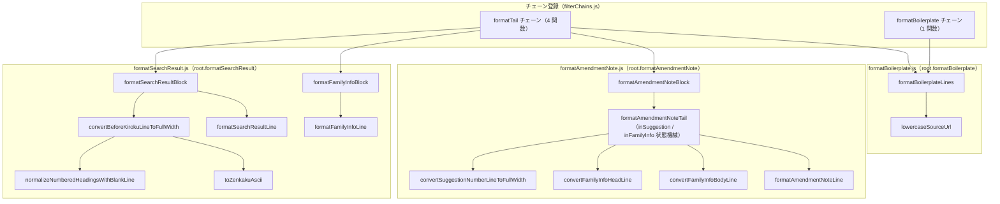

# 末尾ブロックの書式変換 — 構造一覧

この文書は、`js/formatSearchResult.js` / `js/formatAmendmentNote.js` / `js/formatBoilerplate.js` の 3 ファイルで構成される **`formatTail` チェーン（文書末尾ブロックの書式変換）** を表形式でまとめた、**末尾書式変換の深掘り正本**です。あわせて、`finalOfficeAction` 専用の兄弟チェーン **`formatBoilerplate`** も扱います。
コード（上記 3 ファイル／`filterChains.js` / `modeFunctionLists.js`）を変更した場合は、この文書も必ず更新してください。

関連: アーキテクチャ全体・モード→チェーン対応の正本は [../filterRegistry/filterRegistry.md](../filterRegistry/filterRegistry.md)、ボタン→関数のフロー正本は [flow.md](flow.md)、空行削除の深掘り正本は [stripBlankLines.md](stripBlankLines.md)。

---

## 全体像

| 項目 | 内容 |
|---|---|
| 定義ファイル | `js/formatSearchResult.js` / `js/formatAmendmentNote.js` / `js/formatBoilerplate.js` |
| グローバル公開名 | `root.formatSearchResult`（2 関数）／`root.formatAmendmentNote`（1 関数）／`root.formatBoilerplate`（1 関数） |
| 依存 | `root.textPrimitives`（`splitLines` / `joinLines` / `hwAlnum` / `fwNum`） |
| チェーン登録 | `formatTail`（4 関数: `formatSearchResultBlock` → `formatFamilyInfoBlock` → `formatAmendmentNoteBlock` → `formatBoilerplateLines`）／`formatBoilerplate`（1 関数: `formatBoilerplateLines`） |
| 実行されるモード | `officeAction` / `officeActionTight` → `formatTail`（4 段目）／`finalOfficeAction` → `formatBoilerplate`（4 段目） |
| 対象外モード | `pct` / `pct_eng`（`normalize → formatBody` のみ）／`paragraph` / `html`（単一チェーン） |

> `formatTail` と `formatBoilerplate` はどちらもパイプラインの **最終段**。両者の唯一の共通関数が `formatBoilerplateLines`（末尾の定型行整形＋`<>` 全角化）である。

---

## 1. `formatSearchResultBlock` — 先行技術文献調査結果ブロック

定義ファイル: `js/formatSearchResult.js`（公開名 `formatSearchResult.formatSearchResultBlock`）。`formatTail` チェーンの 1 番目。

処理は **2 段**で、`convertBeforeKirokuLineToFullWidth(str)` → ハイフン柵で囲まれた調査結果ブロックの行整形、の順に実行する。

### 1-a. 「記」行より上の全角化（`convertBeforeKirokuLineToFullWidth`）

全文を「記」行の直前で `pre`（上側）／`tail`（「記」行＋以降）に分割し、`pre` 側だけを加工する。`tail` は一切変更しない。「記」行が存在しなければ全文を無変更で返す。

| 項目 | 内容 |
|---|---|
| 「記」行の判定（分割） | 正規表現 `/([\s\S]*?)(^[ 　]*記[ 　]*(?:[（(]引用文献等については引用文献等一覧参照[）)])?[ 　]*$[\s\S]*)/m`（`m` フラグ）。行全体が `[空白]記[空白]（引用文献等については引用文献等一覧参照）?[空白]` のみで構成される行を「記」行とみなす。「…に記載された…」等の文中の「記」はマッチしない |
| 加工 ① | `pre` を `toZenkakuAscii()` で ASCII 記号・数字・英字（`0x21`〜`0x7E`）だけ全角化（`+0xFEE0`）。半角スペース `0x20` は対象外で保持 |
| 加工 ② | `normalizeNumberedHeadingsWithBlankLine()` で番号行を整形（下表） |
| 再結合 | `convertedBefore + "\n" + tail`（`tail` は無変更） |

#### `normalizeNumberedHeadingsWithBlankLine(block, newline)` の番号行整形

`block`（＝「記」より上）を `\n` で分割し、各行を判定する。

| 行種別 | 判定 | 出力 |
|---|---|---|
| 番号行 | `/^([ 　]*)([0-9０-９]+)([\.．])(\s*)(.*)$/` にマッチ | `プレフィックス + 数字 + ドット + （ドット直後の空白を除いた残り本文）` を出力し、**直後に空行を 1 行挿入**。番号行に続く既存の空行はまとめて 1 行に圧縮する |
| それ以外 | 上記に非マッチ | そのまま出力 |

- 末尾行が番号行の場合も、最後に空行を 1 行追加する。
- 改行コードは元テキストから推定（`\r\n` / `\r` / `\n`）し、結合に使う。
- 番号行はドット以降の本文（`m[5]`）を保持し、ドット直後の空白（`m[4]`）のみを落とす。

### 1-b. 調査結果ブロック内部の行整形（`formatSearchResultLine`）

「20 個以上のハイフン行」と「固定メッセージ」に挟まれた内部だけを行単位で整形する。

| 項目 | 内容 |
|---|---|
| 検出正規表現 | `/(-{20,}\r?\n)([\s\S]*?)(\r?\n[ \t　]*この先行技術文献調査結果の記録は、拒絶理由を構成するものではありません。)/g`（`g` フラグ・複数箇所可） |
| 開始マーカー（柵・上） | `-{20,}` ＝ ハイフン 20 個以上＋改行（キャプチャ 1・無変更） |
| 終了マーカー（柵・下） | 改行＋任意空白＋固定文 `この先行技術文献調査結果の記録は、拒絶理由を構成するものではありません。`（キャプチャ 3・無変更） |
| 内部の処理 | キャプチャ 2 を `splitLines` → 各行 `formatSearchResultLine` → `joinLines`。柵と固定メッセージはそのまま維持 |

#### `formatSearchResultLine(str)` の行種別ルール

先頭で `trim()` → 空行はそのまま `""`。次に `hwAlnum()`（全角英数字→半角）。続いて次の順で判定する。

| # | 行種別 | 判定（トリム後・半角化後） | 変換内容 |
|---|---|---|---|
| 0 | 番号のパディング | 正規表現 `\s*(\d+)\s*(\/)\s*(\d+)(\s*-\s*)(\d+)\s*(\/)\s*(\d+)`（`n/m - x/y` 形式） | 数字を全角化し、1 個目を全角幅 2、2〜4 個目を全角幅 3 で右詰め（全角スペース埋め）。区切りは全角 `／`・`－` に統一。例: `7/24-  7/26` → `　７／　２４－　　７／　２６` |
| 1 | 固定 見出し | `<先行技術文献調査結果の記録>` に完全一致 | 全角スペースインデントを前置 |
| 2 | 固定 DB名（IEEE） | `DB名 IEEE 802.11` に完全一致 | `ＤＢ名` を全角化して所定位置に整形 |
| 3 | 固定 DB名（3GPP） | `DB名 3GPP TSG RAN WG1-4` に完全一致 | 同上 |
| 4 | 固定 IEEE 行 | `IEEE 802.11` に完全一致 | 所定インデントに整形 |
| 5 | 固定 3GPP 行 | `3GPP TSG RAN WG1-4` に完全一致 | 所定インデントに整形 |
| 6 | 固定 SA 行 | `SA WG1-4、6` に完全一致 | 所定インデントに整形 |
| 7 | 固定 CT 行 | `CT WG1、4` に完全一致 | 所定インデントに整形 |
| 8 | 調査した分野（IPC） | `/^・調査した分野[\s　]+IPC[\s　]+(.+)$/` | `・調査した分野　　ＩＰＣ　　` ＋末尾（ラベル間の空白を固定・`ＩＰＣ` 全角化。末尾の英数字＝分類記号 `H04B` なども `fwAlnum` で全角化） |
| 9 | 先行技術文献 | `/^・先行技術文献[\s　]+(.+)$/` | `・先行技術文献␣␣` ＋末尾（ラベルと本文の間を半角スペース 2 個に固定） |
| 10 | IPC コード行 | `/^([A-Za-z]\d{2}[A-Za-z].*)$/`（例 `H04B…` / `H04W…`） | 所定の全角スペースインデントを前置し、英数字（分類記号）を `fwAlnum` で全角化 |
| 11 | 国別の文献行 | 行頭が `国` / `特` / `実` / `米` / `中` / `韓` | いずれも全角スペース 8 個相当のインデント＋（先頭文字＋残り） |
| 12 | 既定 | 上記いずれにも非該当 | 全角スペース 8 個相当のインデント＋行内容 |

---

## 2. `formatFamilyInfoBlock` — ファミリー文献情報ブロック

定義ファイル: `js/formatSearchResult.js`（公開名 `formatSearchResult.formatFamilyInfoBlock`）。`formatTail` チェーンの 2 番目。

`<ファミリー文献情報>` から「問合せ文」までの間を行単位で整形する（`g` フラグなし＝先頭 1 箇所のみ）。

| 項目 | 内容 |
|---|---|
| 検出正規表現 | `/(<ファミリー文献情報>\n?)([\s\S]*?)([ 　]*この拒絶理由通知の内容に関するお問合せ又は面接のご希望がありましたら、次の連絡先までご連絡ください。補正案等の送付を希望される際は、その旨を事前にご連絡ください。)/` |
| 開始マーカー | `<ファミリー文献情報>`（＋任意の改行 1 個）… 無変更で残す |
| 終了マーカー（問合せ文） | `この拒絶理由通知の内容に関するお問合せ又は面接のご希望がありましたら、次の連絡先までご連絡ください。補正案等の送付を希望される際は、その旨を事前にご連絡ください。`（先頭に任意空白可）… 無変更で残す |
| 内部の処理 | キャプチャ 2 を `splitLines` → 各行 `formatFamilyInfoLine` → `joinLines`。再結合は `"\n" + header + 本文 + "\n" + footer`（見出し前と問合せ文前に改行 1 個を補う） |

#### `formatFamilyInfoLine(str)` の行種別ルール

`trim()` → 空行はそのまま `""` → `hwAlnum()`（全角英数字→半角）。

| 行種別 | 判定 | 変換内容 |
|---|---|---|
| 数字始まりの行 | `/^([0-9].*)$/`（半角化後の行頭が数字） | そのまま返す（インデントを付けない） |
| 既定 | 上記以外 | 全角スペース 3 個 `　　　` を前置 |

---

## 3. `formatAmendmentNoteBlock` — 補正をする際の注意ブロック

定義ファイル: `js/formatAmendmentNote.js`（公開名 `formatAmendmentNote.formatAmendmentNoteBlock`）。`formatTail` チェーンの 3 番目。

### 3-a. `<補正をする際の注意>` での分割

| 項目 | 内容 |
|---|---|
| 分割正規表現 | `/([\s\S]*?)(<補正をする際の注意>)([\s\S]*)/`（`g` なし・先頭 1 箇所） |
| `pre` | 先頭〜最初の `<補正をする際の注意>` 直前まで … **無変更** |
| `marker` | `<補正をする際の注意>` … **無変更** |
| `tail` | マーカー直後〜末尾 … `formatAmendmentNoteTail(marker, tail)` で整形 |
| マーカーが無い場合 | 下記「3-a′. マーカーが無い場合のフォールバック」を参照 |

### 3-a′. マーカーが無い場合のフォールバック

`<補正をする際の注意>` 自体が無い文書で全文を `formatAmendmentNoteTail` に通すと、本文中の数字まで全角化されてしまう。これを避けるため、連絡先（署名）ブロックだけを整形対象として切り出す。

| 順 | 判定 | 動作 |
|---|---|---|
| 1 | 終端文行 `/^[ 　\t]*この先行技術文献調査結果の記録は、拒絶理由を構成するものではありません。/`（行頭空白許容）が存在するか | あれば、**最初に見つかった**その行の直後から末尾までを整形対象にする |
| 2 | 1 が無い場合、区切り線行 `/^[ 　]*[-－]{10,}[ 　]*$/`（`stripBlankLinesInSignature` と同一定義。[stripBlankLines.md](stripBlankLines.md) の「区切り線〜署名メール行」参照）を末尾側から探索 | 見つかった**最後の 1 本**の直後から末尾までを整形対象にする |
| 3 | 1・2 のいずれも無い場合 | 入力を無変換のまま返す |

整形対象と判定された範囲（区切り位置より後ろ）だけを `formatAmendmentNoteTail("", tail)` に通し、それより前の行は無変更のまま結合する。

### 3-b. `formatAmendmentNoteTail` の状態機械

`tail` を行分割し、`inSuggestion`（＜補正の示唆＞内）／`inFamilyInfo`（＜ファミリー文献情報＞内）の 2 フラグで行を振り分ける。各行は先頭空白を落とした `headTrimmed`（`/^[ \t　]+/` を除去）で判定する。

| 判定（上から優先） | 条件（`headTrimmed`） | 動作 |
|---|---|---|
| 示唆ブロック開始 | `<補正の示唆>` または `＜補正の示唆＞` で始まる | `inSuggestion=true` / `inFamilyInfo=false`。当該行は `formatAmendmentNoteLine` で出力 |
| ファミリー情報ブロック開始 | `<ファミリー文献情報>` または `＜ファミリー文献情報＞` で始まる | `inSuggestion=false` / `inFamilyInfo=true`。当該行は `formatAmendmentNoteLine` で出力 |
| ブロック終端（問合せ文） | `/^この拒絶理由通知の内容に関するお問合せ/` にマッチ | 両フラグを解除。`inFamilyInfo` から抜ける場合は、直前の出力行が空でなければ空行を 1 行挿入。`inFamilyInfo` でない場合は常に空行を 1 行挿入。その後、当該行を `formatAmendmentNoteLine` で出力 |
| 示唆の番号行 | `inSuggestion` かつ `isSuggestionNumberLine(line)` | `convertSuggestionNumberLineToFullWidth(line)` |
| ファミリー情報の空行 | `inFamilyInfo` かつ `line.trim() === ""` | 削除（出力しない） |
| ファミリー情報の番号行 | `inFamilyInfo` かつ `isFamilyInfoHeadLine(line)` | `convertFamilyInfoHeadLine(line)` |
| ファミリー情報の本文行 | `inFamilyInfo` かつ `isFamilyInfoBodyLine(line)` | `convertFamilyInfoBodyLine(line)` |
| 既定 | 上記いずれにも非該当 | `formatAmendmentNoteLine(line)` |

### 3-c. 内部ヘルパの規則

| ヘルパ | 判定／整形規則 |
|---|---|
| `isSuggestionNumberLine` | `/^[ \t　]*[（(][0-9０-９]+[)）]/`。行頭に `(数字)` / `（数字）` があれば真 |
| `convertSuggestionNumberLineToFullWidth` | `/^([ \t　]*)([（(])([0-9０-９]+)([)）])(.*)$/` で分解 → 数字は `fwNum`（全角化）、括弧は半角 `(` `)` に統一、残り本文は `hwAlnum`（全角英数字→半角）後に `(^|[,\s])([a-zA-Z])` で **行頭・カンマ・空白類の直後の英字を大文字化**。例: `(１)fewofwKAoefwp → (１)FewofwKAoefwp` |
| `isFamilyInfoHeadLine` | `/^[ 　]*[0-9０-９]+[\.．]/`。行頭が「数字＋ドット」なら番号行 |
| `convertFamilyInfoHeadLine` | `/^([ 　]*)([0-9０-９]+)([\.．])(.*)$/` で分解 → 数字のみ `fwNum`（全角化・ドットは原文のまま）、以降は `hwAlnum`（英数字のみ半角）。例: `1.GこれKご → １.GこれKご` |
| `isFamilyInfoBodyLine` | `/^[ 　\t]+.*\S.*$/`。行頭に空白があり、その後に非空白がある行 |
| `convertFamilyInfoBodyLine` | 行頭の空白（半角/全角/タブ）をすべて除去 → `hwAlnum`（英数字のみ半角）→ 全角スペース **3 個** `　　　` を前置 |
| `formatAmendmentNoteLine` | 固定行の完全一致（下表）→ 非該当は `hwAlnum` の後 `fwNum`（英数字を半角化してから数字だけ全角に戻す＝英字は半角・数字は全角） |

#### `formatAmendmentNoteLine` の固定行（行頭全角スペース付きの原文に完全一致）

| 入力（原文）| 出力 |
|---|---|
| `　審査第四部伝送システム(PA5J) 飯星 陽平(いいほし ようへい)` | 直前に改行 1 個＋インデント無しの `審査第四部伝送システム(PA5J) 飯星 陽平(いいほし ようへい)` |
| `　TEL.03-3581-1101 内線3534` | 行頭空白を除いた `TEL.03-3581-1101 内線3534` |
| `　※●●●●@jpo.go.jp (上記「●●●●」に置き換えて、「PA5J」と入力ください。)` | 行頭空白を除いた `※●●●●@jpo.go.jp (上記「●●●●」に置き換えて、「PA5J」と入力ください。)` |

---

## 4. `formatBoilerplateLines` — 定型行整形（＋`<>` 全角化）

定義ファイル: `js/formatBoilerplate.js`（公開名 `formatBoilerplate.formatBoilerplateLines`）。`formatTail` チェーンの 4 番目（最後）であり、`formatBoilerplate` チェーンの唯一の関数でもある。

処理順: `lowercaseSourceUrl(text)` → 行ごとに定型行を置換 → 最後に残った `<` / `>` を全角化。

| 内部ヘルパ | 役割 |
|---|---|
| `lowercaseSourceUrl` | `/(取得先\s*<)([\S]+)(>)/g` にマッチする `取得先 <URL>` の **URL 部分だけを小文字化**（前後の `取得先 <` / `>` は不変・複数箇所可） |

### 定型行の置換（行頭空白 `/^[ 　]+/` を無視して `headTrimmed` で完全一致）

| # | 入力（`headTrimmed`）| 出力レイアウト |
|---|---|---|
| 1 | `SA WG1-4、6` | 全角スペースインデント＋`SA  WG1-4、6` |
| 2 | `CT WG1、4` | 全角スペースインデント＋`CT  WG1、4` |
| 3 | `記 (引用文献等については引用文献等一覧参照)` | `　　　　　記　　　（引用文献等については引用文献等一覧参照）`（半角括弧→全角括弧・所定インデント） |
| 4 | `記` | 全角スペースインデント＋`記`（単独の「記」を中央寄せ位置へ） |
| 5 | `------------------------------------`（ハイフン 36 個） | 同数の全角ハイフン `－` による区切り線に置換 |
| 6 | `<最後の拒絶理由通知とする理由>` | `　　　　　　　　　　＜最後の拒絶理由通知とする理由＞`（この行の出力は既に全角 `＜＞`） |
| 7 | `<引用文献等一覧>` | 所定インデント＋`<引用文献等一覧>`（この時点では半角 `<>` のまま。後段の全角化で `＜引用文献等一覧＞` になる） |
| — | 上記以外 | 原文のまま（`raw`） |

### 最終パス: `<` / `>` の全角化

行結合後に `joinLines(outLines).replace(/[<>]/g, …)` を実行し、テキスト中に残った **すべての半角 `<` → `＜`、`>` → `＞`** に変換する。これが `formatTail` / `formatBoilerplate` の締めの処理。

---

## 公開 API 一覧

`formatTail` / `formatBoilerplate` チェーンに登録される公開関数です。

| 公開名 | 名前空間（グローバル）| チェーン | 役割 |
|---|---|---|---|
| `formatSearchResultBlock` | `root.formatSearchResult` | `formatTail`（1） | 「記」行より上の全角化・番号行整形＋ハイフン柵内の調査結果行整形 |
| `formatFamilyInfoBlock` | `root.formatSearchResult` | `formatTail`（2） | `<ファミリー文献情報>`〜問合せ文の間を行整形（既定は全角スペース 3 個インデント） |
| `formatAmendmentNoteBlock` | `root.formatAmendmentNote` | `formatTail`（3） | `<補正をする際の注意>` 以降を状態機械で判定し、示唆の番号行・ファミリー情報ブロックを整形 |
| `formatBoilerplateLines` | `root.formatBoilerplate` | `formatTail`（4）・`formatBoilerplate`（1） | 定型行（「記」／区切り線／`<引用文献等一覧>` 等）の置換＋`<>` 全角化 |

---

## パイプライン上の位置（Office Action 系 / Final Office Action）

`formatTail` / `formatBoilerplate` は **4 段構成の最終段**です。

| 段 | チェーン名 | 末尾書式変換に関係する処理 |
|---|---|---|
| 1 | `normalize` | 改行統一・NFKC 半角化（`<>` も半角に寄る）・制御文字除去・空行削除・行間正規化 |
| 2 | `formatBody` | 本文の見出し・箇条書き・条文番号などの整形／全角化 |
| 3 | `stripBlankLines` / `stripBlankLinesTight` | 各セクションのマーカー間（半角 `<…>` マーカーを含む）の空行削除 |
| 4 | `formatTail` / `formatBoilerplate` | **本文書の対象**。末尾ブロックの書式変換。最後に `<>` を全角化 |

### なぜ末尾書式変換が「最後」なのか（順序依存）

- **`<>` の全角化は必ず最後でなければ壊れる。** `formatBoilerplateLines` の締めで実行される `replace(/[<>]/g, …)`（`<`→`＜`・`>`→`＞`）を早い段に動かすと、それより後で **半角 `<…>` を検出する処理が全滅**する。半角 `<…>` を見る処理は次のとおり:
  - 3 段目 `stripBlankLines` 系のマーカー（例: `<補正をする際の注意>` / `<先行技術文献調査結果の記録>` / `<付記>` / `<優先権の主張の効果について>` / `<補正の示唆>`、`stripBlankLinesInClaimsBlock` の終端 `[<＜]`）。
  - 同じ 4 段目でも `formatBoilerplateLines` **より前**に走る `formatSearchResultBlock`（`<先行技術文献調査結果の記録>`）・`formatFamilyInfoBlock`（`<ファミリー文献情報>`）・`formatAmendmentNoteBlock`（`<補正をする際の注意>` / `<補正の示唆>` / `<ファミリー文献情報>` の半角形）。
  - チェーン内の登録順が `… → formatBoilerplateLines`（最後）であり、かつ `formatBoilerplate` チェーンではこの 1 関数しか無いため、`<>` 全角化はパイプライン全体で最終になる。`formatAmendmentNoteTail` が `<補正の示唆>`（半角）と `＜補正の示唆＞`（全角）の **両方**を受理しているのも、全角化の前後どちらの入力でも拾えるようにする保険。
- **`records`（`<引用文献等一覧>`）の全角化は、行置換の直後の一括パスに委ねている。** 定型行置換（表 #7）はあえて半角 `<引用文献等一覧>` を出力し、締めの `replace(/[<>]/g, …)` で `＜引用文献等一覧＞` に変換する。表 #6 の `<最後の拒絶理由通知とする理由>` は置換出力の時点で既に全角 `＜＞` のため、締めのパスの影響を受けない。

### `officeAction` / `officeActionTight` / `finalOfficeAction` の 4 段目

| モード | 4 段目チェーン | 実行される末尾関数 |
|---|---|---|
| `officeAction` | `formatTail` | `formatSearchResultBlock` → `formatFamilyInfoBlock` → `formatAmendmentNoteBlock` → `formatBoilerplateLines` |
| `officeActionTight` | `formatTail` | 同上（3 段目が `stripBlankLinesTight` になるだけで 4 段目は共通） |
| `finalOfficeAction` | `formatBoilerplate` | `formatBoilerplateLines` のみ |

---

## 編集ガイド

| 変更したい内容 | 触る場所 |
|---|---|
| 定型行を追加・変更（「記」／区切り線／`<引用文献等一覧>` 等）| `js/formatBoilerplate.js` の `formatBoilerplateLines` 内の `headTrimmed === "…"` 分岐 |
| `取得先 <URL>` の扱いを変更 | `js/formatBoilerplate.js` の `lowercaseSourceUrl` |
| 調査結果ブロックの行ルールを追加（DB名・IPC・国別行など）| `js/formatSearchResult.js` の `formatSearchResultLine`（固定一致→ラベル→既定の順で分岐） |
| 「記」行より上の番号行・全角化ルールを変更 | `js/formatSearchResult.js` の `convertBeforeKirokuLineToFullWidth` / `normalizeNumberedHeadingsWithBlankLine` / `toZenkakuAscii` |
| ファミリー文献情報ブロックの範囲・行ルールを変更 | `js/formatSearchResult.js` の `formatFamilyInfoBlock` / `formatFamilyInfoLine`（補正の注意側は `js/formatAmendmentNote.js` の `convertFamilyInfoHeadLine` / `convertFamilyInfoBodyLine`）|
| 補正の示唆の番号行・署名/TEL/メール等の固定行を変更 | `js/formatAmendmentNote.js` の `convertSuggestionNumberLineToFullWidth` / `formatAmendmentNoteLine` |
| ブロック開始・終端マーカーを変更 | `js/formatAmendmentNote.js` の `formatAmendmentNoteTail`（`<補正の示唆>` / `<ファミリー文献情報>` / 問合せ文の判定）|
| マーカー無し文書のフォールバック境界（終端文・区切り線）の検出を変更 | `js/formatAmendmentNote.js` の `formatAmendmentNoteBlock`（`TERM_RE` / `DIV_RE`）。区切り線の判定は `js/stripBlankLines.js` の `stripBlankLinesInSignature` と同一の正規表現を再利用しているため、変更する場合は両ファイルおよび [stripBlankLines.md](stripBlankLines.md) を揃えること |
| チェーン構成（関数の並び）を変更 | `js/filterChains.js` の `register("formatTail", […])` / `register("formatBoilerplate", […])` |
| モードごとの 4 段目の割り当てを変更 | `js/modeFunctionLists.js` の `names` 配列 |
| ドキュメント更新 | 本ファイル・`js/flow.md`・`filterRegistry/filterRegistry.md`・`README.md` |
