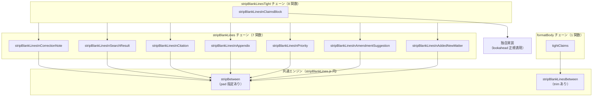

# マーカー間の空白行削除 — 構造一覧

この文書は、`js/stripBlankLines.js` における **「開始マーカー ～ 終了マーカー」に挟まれた範囲の空白行を削除する** 仕組みを表形式でまとめたものです。
コード（`stripBlankLines.js` / `filterChains.js` / `modeFunctionLists.js`）を変更した場合は、この文書も必ず更新してください。

---

## 全体像



| 項目 | 内容 |
|---|---|
| 定義ファイル | `js/stripBlankLines.js` |
| グローバル公開名 | `root.stripBlankLines` |
| 依存 | `root.textPrimitives`（`splitLines` / `joinLines` / `isBlankLine` / `escapeRegExp`） |
| チェーン登録 | `stripBlankLines`（7 関数）/ `stripBlankLinesTight`（8 関数・末尾に `stripBlankLinesInClaimsBlock`） |
| 実行されるモード | `officeAction` / `finalOfficeAction` → `stripBlankLines`／`officeActionTight` → `stripBlankLinesTight` |
| 対象外モード | `pct` / `pct_eng` / `paragraph` / `html` |

---

## 共通エンジン（2 種）

「？？ ～ ？？」＝開始マーカーと終了マーカーに挟まれた **内部テキスト** を対象に、空白行だけを落とす処理です。実装は 2 系統あります。

| エンジン | 使用する関数 | 空行判定 | マーカー直後・直前の改行（pad） | 内部の trim | 備考 |
|---|---|---|---|---|---|
| `stripBetween` | `stripBlankLinesIn*` 7 関数 | `textPrimitives.isBlankLine` | `pad.before` / `pad.after` で制御 | なし | 正規表現 `(start)([\s\S]*?)(end)` で非貪欲マッチ |
| 独自（lookahead） | `stripBlankLinesInClaimsBlock` | `textPrimitives.isBlankLine` | ヘッダ直後 `\n`、終端行直前に空行 1 行を残す | なし | 終端は `(?=\n(?:・請求項\|●理由\|[<＜]))` で先読み（消費しない） |
| `stripBlankLinesBetween` | `tightClaims` | `isBlankLineLoose`（`\n` も空白類に含む緩和版） | なし（pad 概念なし） | `joinLines(outLines).trim()` あり | `stripBetween` と統合すると出力が変わるため並存 |

### `stripBetween` の処理手順

| 順 | 処理 |
|---|---|
| 1 | 入力を文字列化。`startMarker` / `endMarker` が配列なら全組み合わせ（start × end）を順に適用 |
| 2 | 正規表現で `(開始マーカー)(内部)(終了マーカー)` を検索（`g` フラグ・非貪欲） |
| 3 | 内部を `splitLines` で行分割し、`isBlankLine` が true の行を除去 |
| 4 | `pre + (pad.before ? "\n" : "") + joinLines(outLines) + (pad.after ? "\n" : "") + post` で再結合 |
| 5 | 範囲外のテキストは変更しない。ネスト・複雑な重なりは非対応（簡易実装） |

### pad（改行パディング）の意味

| オプション | `true` のとき | `false` のとき |
|---|---|---|
| `pad.before` | 開始マーカー直後に `\n` を 1 つ挿入 | 開始マーカーと本文を改行なしで直結 |
| `pad.after` | 終了マーカー直前に `\n` を 1 つ挿入 | 本文と終了マーカーを改行なしで直結 |

---

## stripBlankLines チェーン — 関数ごとのマーカー対応

`filterChains.js` に登録された実行順です。いずれも内部で **`stripBetween`** を使用します。

| 順 | 関数名 | 開始マーカー（？？） | 終了マーカー（？？） | pad.before | pad.after | 追加処理 |
|---|---|---|---|---|---|---|
| 1 | `stripBlankLinesInCorrectionNote` | `<補正をする際の注意>` | `(上記「●●●●」に置き換えて、「PA5J」と入力ください。)` | true | false | — |
| 2 | `stripBlankLinesInSearchResult` | `<先行技術文献調査結果の記録>` | `　この先行技術文献調査結果の記録は、拒絶理由を構成するものではありません。` | true | true | — |
| 3 | `stripBlankLinesInCitation` | `引用文献１(特に` / `引用文献２(特に`（配列・複数パターン） | `　ことが記載されている。` / `　が記載されている。`（配列） | false | true | 後処理で `こと[\s\u3000]*が記載されている。` → `ことが記載されている。` に正規化 |
| 4 | `stripBlankLinesInAppendix` | `<付記>` | `　この付記は、拒絶理由を構成するものではありません。` | true | true | — |
| 5 | `stripBlankLinesInPriority` | `<優先権の主張の効果について>` | `優先権の主張の効果が認められない。` | true | false | — |
| 6 | `stripBlankLinesInAmendmentSuggestion` | `<補正の示唆>` | `　なお、上記の補正の示唆は、法律的効果を生じさせるものではなく、拒絶理由を解消するための一案である。明細書等についてどのように補正をするかは、出願人が決定すべきものである。` | true | true | — |
| 7 | `stripBlankLinesInAddedNewMatter` | `例えば、請求項１は、` | `」と認める。` | true | false | — |

### 引用文献（`stripBlankLinesInCitation`）のマーカー組み合わせ

開始 × 終了の全組み合わせ（最大 4 パターン）に対して `stripBetween` が順に適用されます。

| # | 開始 | 終了 |
|---|---|---|
| 1 | `引用文献１(特に` | `　ことが記載されている。` |
| 2 | `引用文献１(特に` | `　が記載されている。` |
| 3 | `引用文献２(特に` | `　ことが記載されている。` |
| 4 | `引用文献２(特に` | `　が記載されている。` |

---

## stripBlankLinesTight チェーン — 請求項ヘッダブロック

`stripBlankLines` の 7 関数に加え、8 番目として **`stripBlankLinesInClaimsBlock`** が追加されたチェーンです。`officeActionTight` モード専用。

| 順 | 関数名 | 備考 |
|---|---|---|
| 1〜7 | `stripBlankLines` と同じ 7 関数 | 上表を参照 |
| 8 | `stripBlankLinesInClaimsBlock` | 請求項ヘッダブロック内の空行削除（下表） |

### `stripBlankLinesInClaimsBlock` の範囲定義

`stripBetween` は使わず、行頭一致の正規表現＋先読み（lookahead）で範囲を切り出します。

| 項目 | 内容 |
|---|---|
| 開始（ヘッダ群） | 行頭 `・請求項…`（任意で続けて `・引用文献等…` / `・備考…`） |
| 終了（終端行の手前） | `(?=\n(?:・請求項\|●理由\|[<＜]))` — 次のいずれかの行の直前まで（終端行は消費しない）: ① `・請求項` で始まる行（次のヘッダ群） ② `●理由` で始まる行（●むすび等、他の●行では終端しない） ③ `<` / `＜` で始まる山括弧見出し行（例: `<引用文献等一覧>`。最終ブロックの終端になることが多い） |
| 対象テキスト | ヘッダ群と終端行の間の **本文** のみ |
| 空行削除後 | ヘッダ直後に `\n`、本文、終端行直前に空行 1 行（`\n`）を残す |
| 本文が空のとき | ヘッダ群と終端行が隣接している等、本文行が 0 行なら改変しない |
| 対象外 | 終端行が見つからない末尾の本文 |

#### ヘッダ群の正規表現（`CLAIMS_HEADER_SRC`）

```
・請求項[^\n]*(?:\n・引用文献等[^\n]*)?(?:\n・備考[^\n]*)?
```

| パターン | 例 |
|---|---|
| `・請求項` のみ | `・請求項` / `・請求項　１－３` |
| `・請求項` + `・引用文献等` | 2 行ヘッダ群 |
| `・請求項` + `・引用文献等` + `・備考` | 3 行ヘッダ群 |

---

## formatBody チェーン — 『』内の空白行削除

`stripBlankLines` チェーンとは別に、`formatBody` チェーンの最終ステップとして **`tightClaims`** が呼ばれます。

| 項目 | 内容 |
|---|---|
| 関数名 | `tightClaims` |
| 開始マーカー | `『` |
| 終了マーカー | `』` |
| エンジン | `stripBlankLinesBetween`（`stripBetween` ではない） |
| チェーン登録 | `filterChains.register("formatBody", [..., tightClaims])` |
| 実行タイミング | `stripBlankLines` チェーンより **前**（`formatBody` 段階） |

---

## 公開 API 一覧

`root.stripBlankLines` にエクスポートされる関数です。

| 公開名 | チェーン | 役割 |
|---|---|---|
| `stripBlankLinesInCorrectionNote` | `stripBlankLines` | 補正の注意ブロック内の空行削除 |
| `stripBlankLinesInSearchResult` | `stripBlankLines` | 先行技術文献調査結果ブロック内の空行削除 |
| `stripBlankLinesInCitation` | `stripBlankLines` | 引用文献ブロック内の空行削除＋文言正規化 |
| `stripBlankLinesInAppendix` | `stripBlankLines` | 付記ブロック内の空行削除 |
| `stripBlankLinesInPriority` | `stripBlankLines` | 優先権ブロック内の空行削除 |
| `stripBlankLinesInAmendmentSuggestion` | `stripBlankLines` | 補正の示唆ブロック内の空行削除 |
| `stripBlankLinesInAddedNewMatter` | `stripBlankLines` | 新規事項追加認定ブロック内の空行削除 |
| `stripBlankLinesInClaimsBlock` | `stripBlankLinesTight` | 請求項ヘッダブロック（`・請求項` 群〜終端行（次の `・請求項` / `●理由` / 山括弧見出し）手前）内の空行削除 |
| `tightClaims` | `formatBody` | 請求項引用（`『…』`）内の空行削除 |

---

## パイプライン上の位置（Office Action 系）

| 段 | チェーン名 | 空白行削除に関係する処理 |
|---|---|---|
| 1 | `normalize` | 全文の空行削除（`rmBlank`）・行間挿入（`gap`）— マーカー範囲とは無関係 |
| 2 | `formatBody` | **`tightClaims`**：`『』` 内のみ空行削除 |
| 3 | `stripBlankLines` / `stripBlankLinesTight` | 各セクションのマーカー間の空行削除。Tight は加えて請求項ヘッダブロックも詰める |
| 4 | `formatTail` / `formatBoilerplate` | 末尾ブロックの書式変換（空行削除エンジンは使わない） |

### officeAction と officeActionTight の違い

| モード | 3 段目チェーン | 請求項ヘッダブロック |
|---|---|---|
| `officeAction` | `stripBlankLines`（7 関数） | 処理しない |
| `officeActionTight` | `stripBlankLinesTight`（8 関数） | `stripBlankLinesInClaimsBlock` で空行削除 |

---

## 新しい「？？ ～ ？？」範囲を追加するとき

| 手順 | 触る場所 |
|---|---|
| 1. ヘルパ関数を追加 | `js/stripBlankLines.js`（`stripBetween(s, start, end, pad)` を呼ぶ） |
| 2. 公開オブジェクトに登録 | 同ファイル末尾の `root.stripBlankLines = { ... }` |
| 3. チェーンに追加 | `js/filterChains.js` の `filterChains.register("stripBlankLines", [...])`（必要なら `stripBlankLinesTight` にも） |
| 4. 存在チェックを更新 | 同ファイル先頭付近の `typeof ... !== "function"` 検証 |
| 5. ドキュメント更新 | 本ファイル・`js/flow.md` |
